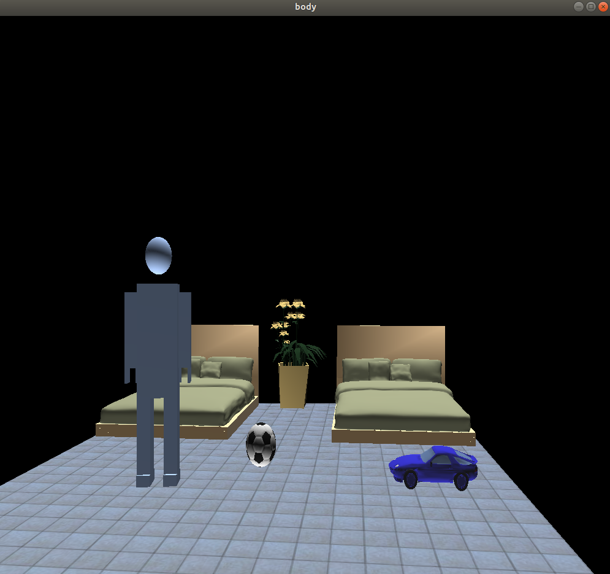
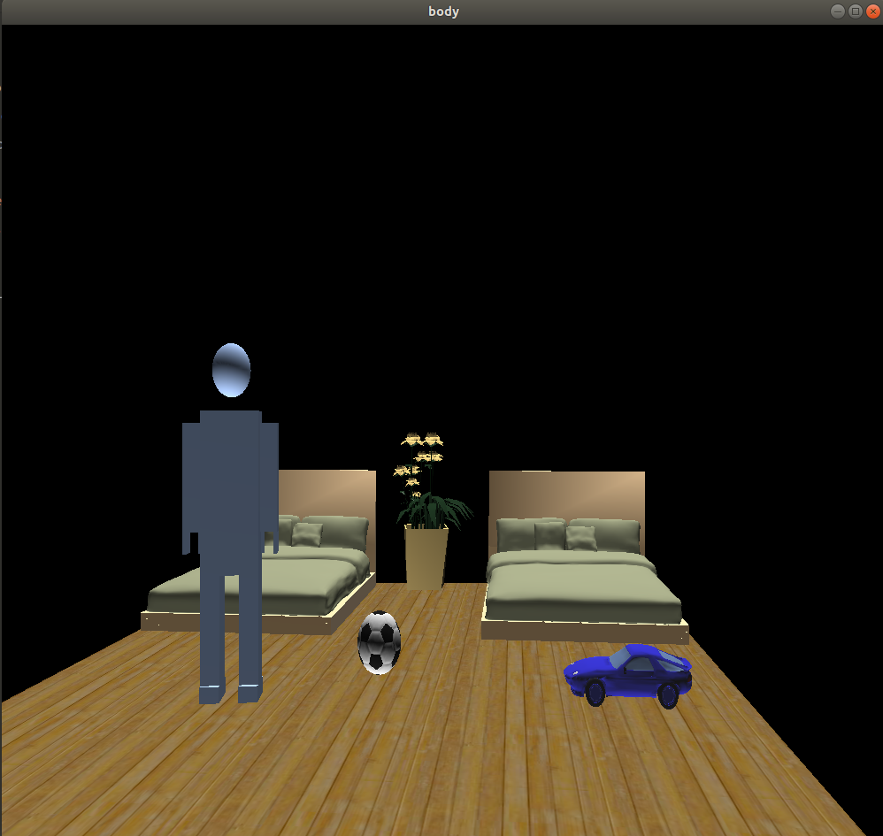
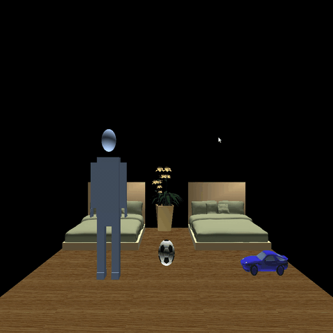

#&nbsp;	&nbsp; &nbsp; &nbsp; &nbsp; &nbsp;	&nbsp; &nbsp; &nbsp; &nbsp; &nbsp;&nbsp;	&nbsp; &nbsp; &nbsp; &nbsp; Computer graphics final project
 

##Team members:
### 1- Abdulla Elsayed &emsp;&emsp;&emsp;&emsp;2- Abdulla Reda Drwesh
### 3- Mohamed Elsayed &emsp;&emsp;&emsp;&emsp;4- Mohammed Omar
### 5- Zeinab Walid

 
## Introduction
*This project is a simple simulation for a bedroom with some furnitures and robot. There are many features in this simualtion can be used for example you can change the color of the floor (Texture mapping) by a menu when right mouse is clicked, you can also control some movements of the robot.*

 

## Room furnitures
* *2-beds*
* *ball*
* *Toy*
* *Planting pot*

<tr>
    <td>  </td>
    <td>  </td>
    <td>  </td>

</tr>

 
## Used methods
### 1) initRendering method
	initRendering(String floor)
*This function take an image path with ".bmp" extension, save it in a Image object and then pass it to another function which is called "loadTexture" to render it, and then adjust material properties and lights GL_LIGHT0 and GL_LIGHT1.*

*Parameters :  floor(String) &rarr; Path of the image*

	void initRendering(char floor[]) {
	    Image *image = loadBMP(floor);
	    _textureId = loadTexture(image);
	    delete image;
	    glEnable(GL_LIGHTING);
	    // Flip light switch
	    glEnable(GL_LIGHT0);
	    glEnable(GL_LIGHT1);
	    // assign light parameters
	    glLightfv(GL_LIGHT0, GL_AMBIENT, light_ambient);
	    glLightfv(GL_LIGHT0, GL_DIFFUSE, light_diffuse);
	    glLightfv(GL_LIGHT0, GL_SPECULAR, light_specular);
	    glLightfv(GL_LIGHT1, GL_AMBIENT, light_ambient);
	    glLightfv(GL_LIGHT1, GL_DIFFUSE, light_diffuse);
	    glLightfv(GL_LIGHT1, GL_SPECULAR, light_specular);
	    // Material Properties
	    glMaterialfv(GL_FRONT_AND_BACK, GL_AMBIENT_AND_DIFFUSE, mat_amb_diff);
	    glMaterialfv(GL_FRONT, GL_SPECULAR, mat_specular);
	    glMaterialfv(GL_FRONT, GL_SHININESS, shininess);
	    GLfloat lightColor1[] = {1.0f, 1.0f, 1.0f, 1.0f};
	    glLightfv(GL_LIGHT1, GL_DIFFUSE, lightColor1);
	    glLightfv(GL_LIGHT1, GL_POSITION, lightPos1);
	    glLightfv(GL_LIGHT0, GL_DIFFUSE, lightColor1);
	    glEnable(GL_NORMALIZE);
	    //Enable smooth shading
	    glShadeModel(GL_SMOOTH);
	    // Enable Depth buffer
	    glEnable(GL_DEPTH_TEST);
	
	}

### 2) loadTexture method
	GLuint loadTexture(Image *image) 
*This function take object image as argument and then show it in 2d dimension space mapping it to the floor with keeping pixels value.*

*Parameters : image &rarr; Pointer to image object*

	GLuint loadTexture(Image *image) {
	    GLuint textureId;
	    glGenTextures(1, &textureId); //Make room for our texture
	    glBindTexture(GL_TEXTURE_2D, textureId); //Tell OpenGL which texture to edit
	    //Map the image to the texture
	    glTexImage2D(GL_TEXTURE_2D,                //Always GL_TEXTURE_2D
	                 0,                            //0 for now
	                 GL_RGB,                       //Format OpenGL uses for image
	                 image->width, image->height,  //Width and height
	                 0,                            //The border of the image
	                 GL_RGB, //GL_RGB, because pixels are stored in RGB format
	                 GL_UNSIGNED_BYTE, //GL_UNSIGNED_BYTE, because pixels are stored
	            //as unsigned numbers
	                 image->pixels);               //The actual pixel data
	    return textureId; //Returns the id of the texture
	}

### 3) walk method
	walk(int value)
*This function is responsile for moving the robot in its place.*

*Parameters :  value(int) &rarr; passed by timer function but not used*

	void walk(int value) {
	    f1 = f1 % 6;
	    setPoses(f1, 1);
	    f1++;
	    glutPostRedisplay();
	    glutTimerFunc(150, walk, 0);
	}

### 4) jump method
	jump(int value)
*This function is responsile for jumping the robot in its place.*

*Parameters :  value(int) &rarr; passed by timer function but not used* 

	void jump(int value) {
	    f2 = f2 % 9;
	    setPoses(f2, 2);
	    f2++;
	    glutPostRedisplay();
	    glutTimerFunc(150, jump, 0);
	}

### 5) setPoses method
	setPoses(int frame, int num)
*This function is responsile for rendering the animation according to the passed frame *

*Parameters :  frame(int) &rarr; Index that determine which pose to show*  
&nbsp;	&nbsp; &nbsp; &nbsp; &nbsp; &nbsp;	&nbsp; &nbsp; &nbsp; &nbsp; &nbsp;&nbsp;	&nbsp; &nbsp; num(int) &rarr; Determine type of the animation, its values is one or two ; 

	void setPoses(int frame, int num){
    switch (num) {
        case 1:
            shoulder2_1 = poses1[frame][0];
            shoulder2_2 = poses1[frame][1];
            elbow = poses1[frame][2];
            rhip = poses1[frame][3];
            rknee = poses1[frame][4];
            lhip = poses1[frame][5];
            lknee = poses1[frame][6];
            break;
        case 2 :
            lknee = poses2[frame][0];
            rknee = poses2[frame][1];
            shoulder2_1 = poses2[frame][2];
            shoulder2_2 = poses2[frame][3];
            elbow = poses2[frame][4];
            Y = poses2[frame][5];
            break;
    }
	}

 
 
## Animations
### Idea of animations : doing sport.
### Problems : There was no problems.
* Walking

* Jumping

 

